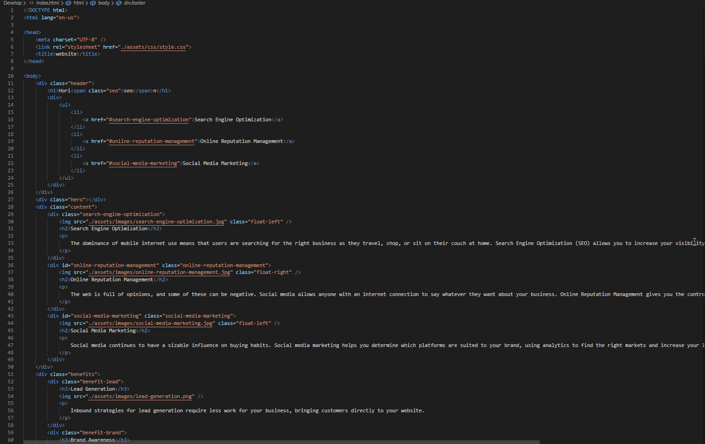
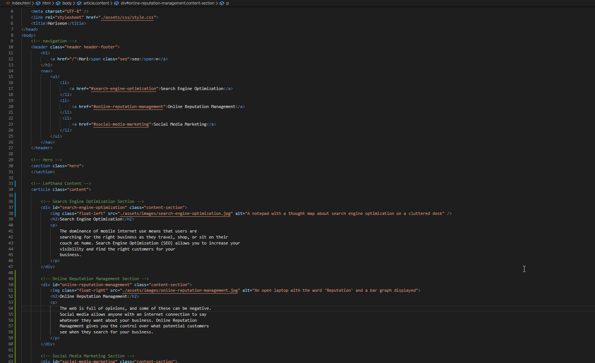
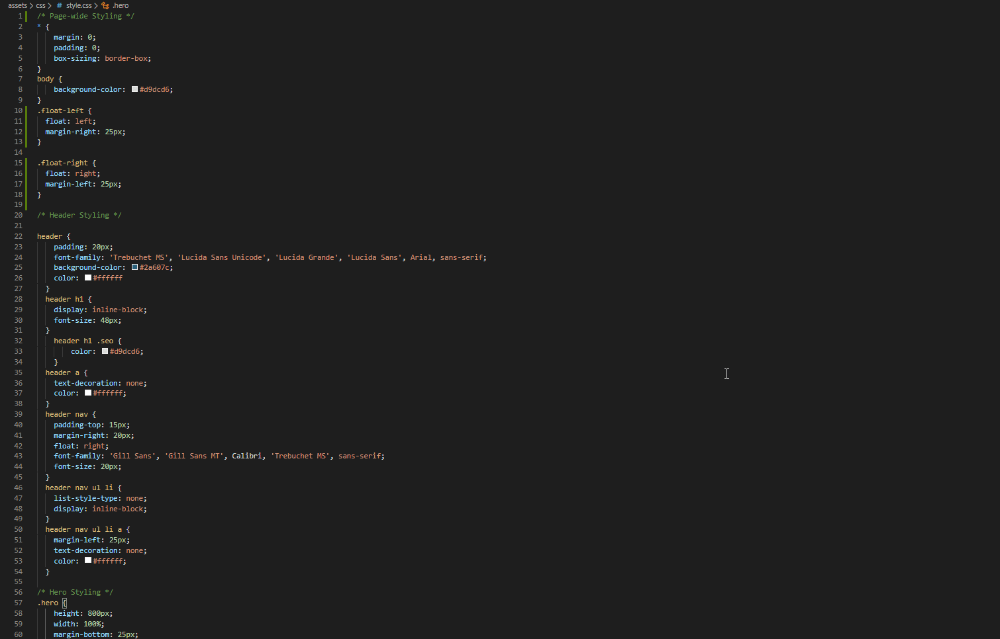

<h1 style="text-align: left;"><strong>The Horiseon Acessibility Overhaul&nbsp;</strong></h1>

I believe that everyone is entitled to use the internet, regardless of any disabilities they might&nbsp;

have, so I've set out to overhaul all of Horieson's landing page code.&nbsp;

<h2><strong>Motivation</strong></h2>

I don't believe it's fair to exclude an entire group of people from being able to view or enjoy your&nbsp;

website simply because you were being lazy while developing it. To ensure everyone is included,&nbsp;

an accesibility overhaul was needed.

<h2>&nbsp;</h2>
<h2 style="text-align: left;"><strong>Sreenshots</strong></h2>
<h3>Before:</h3>

<h3>After:</h3>

&nbsp;

<h2>Link to website</h2>

To view the Horiseon website for yourself, please visit:&nbsp;<a href="https://codyrobbins99.github.io/horiseon-accessibility-overhaul/">https://codyrobbins99.github.io/horiseon-accessibility-overhaul/</a>.
